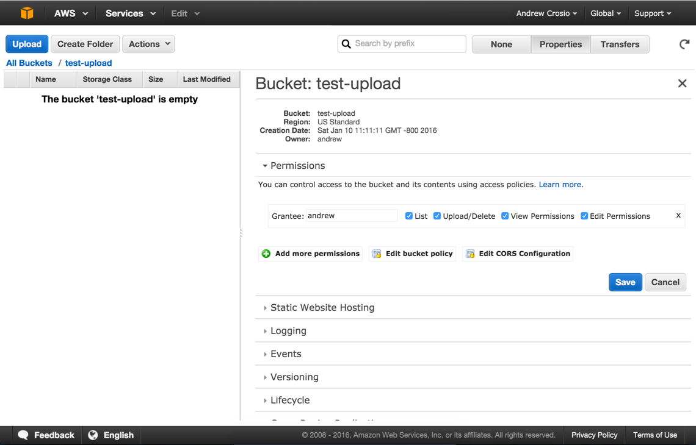
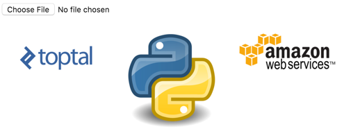

# Microservices w/ AWS Lambda + Python

When building web applications, there are many choices to be made that once committed to may either help or
hinder your application in the future; choices such as language, framework, hosting, database, and many more.

One such choice is whether to create a service-based application using Service Oriented Architecture or a traditional,
monolithic application. This is a common architectural decision affecting start-ups, scale-ups, and enterprise companies 
alike.

Service Oriented Architecture is used by a large number of well-known unicorns and top-tech companies such as Google, 
Facebook, Twitter, Instagram and Uber. Seemingly, this architecture pattern works for large companies; but can it 
work for you?

In this article we will broach the topic of Service Oriented architecture, and how AWS Lambda, in combination with
Python, can be leveraged to easily build scalable, cost-efficient services.

## What is Service Oriented Architecture?

Service Oriented Architecture (SOA) isn’t new, having roots several decades ago. In recent years its popularity
as a pattern has been growing due to offering many benefits for web-facing applications.

SOA is, in essence, the abstraction of one large application into many communicating smaller applications. 
This follows several best practices of software engineering such as de-coupling, separation of concerns and 
single-responsibility architecture.

Implementations of SOA vary in terms of granularity, from very few services that cover large areas of functionality to 
many dozens or hundreds of small applications in what is termed "microservice" architecture. 

Whichever level of granularity, what is generally agreed amongst practitioners of SOA is that it is by no means a free 
lunch. Like many good practices in software engineering it is an investment that will require extra planning, 
development and testing in the short-term.

## Pros and Cons

There are very few one-size-fits-all solutions in software architecture. Whether SOA will work for your needs is
dependant on may factors including the intended longevity, desired scalability and cost of rewriting for your 
application.

### SOA Pros

- It is possible to use different technologies between services
- Scalability
- Simplicity
- Smaller and simpler codebase improves maintainability
- Easier to iterate and rebuild
- Quicker, easier deployments typically

### Monolithic Pros

- Everything is accessible in the same project
- Consistency is typically easier to enforce
- Difficult and complicated to mix different technologies
- Testing is usually easier due to fewer external integrations
- Simpler deployment pipeline

### SOA Cons

- Requires complex integrations of many components
- Service discovery is usually required
- Testing integrations can be difficult
- Requires a more complex deployment pipeline
- Difficult to maintain consistency amongst services

### Monolithic Cons

- Complex and large codebase decreases maintainability
- Scalability is more difficult
- Difficult to iterate and rebuilding is usually very costly
- Slower deployments typically

## What is AWS Lambda?

AWS Lambda is a service offered by the Amazon Web Sercices platform. AWS Lambda allows you to upload code that will
be run on an on-demand container managed by Amazon. AWS Lambda will manage the provisioning and managing of servers
to run the code, so all that is needed from the user is a packaged set of code to run and a few configuration options
to define the context in which the server runs. These managed applications are referred to as Lambda functions.

AWS Lambda has two main modes of operation:

**Asynchronous / Event-Driven:**

Lambda functions can be run in response to an event in asynchronous mode. Any source of evens, such as S3, SNS, etc.
will not block and Lambda functions can take advantage of this in many ways such as establishing a processing 
pipeline for some chain of events. There are many sources of information, and depending on the source events will
be pushed to a Lambda function from the event source, or polled for events by AWS Lambda.

**Synchronous / Request->Response:**

For applications that require a response to be returned synchronously, Lambda can be run in synchronous mode.
Typicall this is used in conjunction with a service called API Gateway to return HTTP responses from AWS Lambda
to an end-user, however Lambda functions can also be called synchronously via a direct call to AWS Lambda.


AWS Lambda functions are uploaded as a zip file containing handler code in addition to any dependencies required
for the operation of the handler. Once uploaded, AWS Lambda will execute this code when needed and scale the number
of servers from zero to thousands when required without any extra intervention required by the consumer.

## Lambda functions as an evolution of SOA

Basic SOA is a way to structure your code-base into small applications in order to benefit an application in the ways 
described earlier in this article. Arising from this, the method of communication between these applications comes into 
focus. Event-driven SOA (aka SOA 2.0) allows for not only the traditional direct service-to-service communication of 
SOA 1.0, but also for events to be propagated throughout the architecture in order to communicate change.

Event-driven architecture is a pattern that promotes loose coupling and composability naturally. By creating and 
reacting to events, services can be added ad-hoc to add new functionality to an existing event, and several events 
can be composed to provide richer functionality.

AWS Lambda can be used as a platform to easily build SOA 2.0 applications. There are many ways to trigger 
a Lambda function; from the traditional message-queue approach with Amazon SNS, to events created by a file being 
uploaded to Amazon S3, or an email being sent with Amazon SES.

## Implementing a Simple Image Uploading Service

### Overview

We will be building a simple application to upload and retrieve images utilising the AWS stack. This example project 
will contain two lambda functions: one running in request->response mode that will be used to serve our simple web 
frontend, and another than will detect uploaded images and resize them.
 
The first lambda function will run asynchronously in response to a file-upload event triggered on the S3 bucket that
will house the uploaded images. It will take the image provided and resize it according to fit within a 400x400 image.

The other lambda function will serve the HTML page, providing both the functionality for a user to view
the images resized by our other Lambda function as well as an interface for uploading an image.

### Initial AWS Configuration

Before we can begin we will need to configure some necessary AWS services such as IAM and S3. These will be configured 
using the web-based AWS console. However, most of the configuration can also be achieved by using the AWS 
command-line utility, which we will use later.

### Creating S3 Buckets

S3 (or Simple Storage Service) is an Amazon object-store service that offers reliable and cost-efficient storage of
any data. We will be using S3 to store the images that will be uploaded, as well as the resized versions of the
images we have processed.

The S3 service can be found under the "Services" drop-down in the AWS console under the "Storage & Content Delivery"
sub-section. When creating a bucket you will be prompted to enter both the bucket name as well as to select a region. 
Selecting a region close to your users are will allow S3 to optimize for latency and cost, as well as some regulatory
factors. For this example we will select the "US Standard" region. This same region will later be used for hosting 
the AWS Lambda functions.

It is worth noting that S3 bucket names are required to be unique, so if the name chosen is taken
you will be required to choose a new, unique name.

For this example project, we will create two storage buckets named "test-upload" and "test-resized".
The "test-upload" bucket will be used for uploading images and storing the uploaded image before it is processed and
resized. Once resized, the image will be saved into the "test-resized" bucket, and the raw uploaded image removed.

### S3 Upload Permissions

By default, S3 Permissions are restrictive and will not allow external users, or even non-administrative users, to
read, write, update, or delete any permissions or objects on the bucket. In order to change this, we will need to be
logged in as a user with the rights to manage AWS bucket permissions.

Assuming we are on the AWS console, we can view the permissions for our upload bucket by selecting the bucket by name,
clicking on the "Properties" button in the top-right of the screen, and opening the collapsed "Permissions" section.



In order to allow anonymous users to upload to this bucket, we will need to edit the bucket policy to allow the
specific permission that allows upload to be allowed. This is accomplished through a JSON-based configuration policy.
These kind of JSON policies are used widely throughout AWS in conjunction with the IAM service. Upon clicking on the
"Edit Bucket Policy" button, simply paste the following text and click "Save" to allow public image uploads:

```json
{
  "Version": "2008-10-17",
  "Id": "Policy1346097257207",
  "Statement": [
    {
      "Sid": "Allow anonymous upload to /",
      "Effect": "Allow",
      "Principal": {
        "AWS": "*"
      },
      "Action": "s3:PutObject",
      "Resource": "arn:aws:s3:::test-upload/*"
    }
  ]
}
```
*Public Upload Bucket Policy*

After doing this, we can verify the bucket policy is correct by attempting to upload an image to the bucket. The
following cURL command will do the trick:

```bash
curl https://test-upload.s3.amazonaws.com -F 'key=test.jpeg' -F 'file=@test.jpeg'
```

If a 200-range response is returned, we will know that the configuration for the upload bucket has been successfully
applied. Our S3 buckets should now be (mostly) configured. We will return later to this service in the console in order
to connect our image upload events to the invocation of our resize function.

## IAM Permissions for Lambda

Lambda roles all run within a permission context, in this case a "role" defined by the IAM service. This role
defines any and all permissions that the Lambda function has during its invocation. For the purposes of this example 
project, we will create a generic role that will be used between both of the Lambda functions, however in a production 
scenario finer granularity in permission definitions is recommended to ensure that any security exploitations are 
isolated to only the permission context that was defined.

The IAM service can be found within the "Security & Identity" sub-section of the "Services" drop-down. The IAM service
is a very powerful tool for managing access across AWS services, and the interface provided may be a bit over-whelming
at first if you are not familiar with similar tools.

Once on the IAM dashboard page, the "Roles" sub-section can be found on the left-hand side of the page. From here
we can use the "Create New Role" button to bring up a multi-step wizard to define the permissions of the role. Let's
use "lambda_role" as the name of our generic permission. After continuing from the name definition page, you will
be presented with the option to select a role type. As we only require S3 access, click on "AWS Service Roles" and 
within the selection box select "AWS Lambda". You will be presented with a page of policies that can be attached to this
role. Select the "AmazonS3FullAccess" policy and continue to the next step to confirm the role to be created.

It is important to note the name and the ARN (Amazon Resource Name) of the created role. This will be used when 
createing a new Lambda function to identify the role that is to be used for function invocation.

**Note:** AWS Lambda will automatically log all output from function invocations in AWS Cloudwatch, a logging service.
If this functionality is desired, which is recommended for a production environment, permission to write to a
Cloudwatch log stream must be added to the policies for this role.

## The Code!

### Overview

Now we are ready to start coding. We will assume at this point you have set up the "awscli" command. If you have not,
you can follow the instructions at [https://aws.amazon.com/cli/](https://aws.amazon.com/cli/) to set up awscli on
your computer.

**Note:** the code used in these examples is made shorter for ease of screen-viewing. For a more complete version
visit the repository at [https://github.com/gxx/aws-lambda-python/](https://github.com/gxx/aws-lambda-python/).

Firstly, let's set up a skeleton structure for our project.

```
aws-lambda-python/
- image_list/
  - handler.py
  - list.html
  - Makefile
  - requirements.txt
- image_resize/
  - handler.py
  - resize.py
  - Makefile
  - requirements.txt
- .pydistutils.cfg
```

We have two sub-directories in our structure, one for each of our lambda functions. In each of these we have
the common handler.py, Makefile, and requirements.txt files. The handler.py file will contain the method to call
on the invocation of each of the lambda functions, and can be considered the entry point for the functions. The
requirements.txt file will contain a list of our dependencies, so we can easily specify and update requirements.
Lastly, the Makefile command we will use to provide an easy mechanism for interacting with awscli. This will make
the process of creating and update our lambda function much easier.

You will notice the .pydistutils.cfg file in the root of our project directory. This file is required if you are
working with Python under Homebrew. Due to the method of deploying a Lambda function (covered in the following section)
this file is needed. See the repository for more details.

### Resize Image Lambda Function

#### Code

Starting with the resize_image function, we will freeze the depending on Wand, our image-processing library and
save `Wand==0.4.2` to requirements.txt. This will be the only dependency for our image_resize lambda function.
The resize_image function in resize.py will need to handle an image resource from the Wand library, and resize
it according to the width and height parameters specified. In order to preserve the image that is being resized,
we will use a "best-fit" resizing algorithm, that will maintain the image ratio of the original image, while reducing
the image size to fit within the specified width and height.


```python
def resize_image(image, resize_width, resize_height):
    ...
    original_ratio = image.width / float(image.height)
    resize_ratio = resize_width / float(resize_height)

    # We stick to the original ratio here, regardless of what the resize ratio is
    if original_ratio > resize_ratio:
        # If width is larger, we base the resize height as a function of the ratio of the width
        resize_height = int(round(resize_width / original_ratio))
    else:
        # Otherwise, we base the width as a function of the ratio of the height
        resize_width = int(round(resize_height * original_ratio))
    if ((image.width - resize_width) + (image.height - resize_height)) < 0:
        filter_name = 'mitchell'
    else:
        filter_name = 'lanczos2'
    image.resize(width=resize_width, height=resize_height, filter=filter_name, blur=1)
    return image
```
*image_resize/resize.py - resize_image function*

With that out of the way, a handler function is required to accept the event generated by an image
uploaded S3, hand it off to the `resize_image` function, and save the resulting resized image. 

```
from __future__ import print_function
import boto3
from wand.image import Image
from resize import resize_image


def handle_resize(event, context):
    # Obtain the bucket name and key for the event
    bucket_name = event['Records'][0]['s3']['bucket']['name']
    key_path = event['Records'][0]['s3']['object']['key']
    response = boto3.resource('s3').Object(bucket_name, key_path).get()  # Retrieve the S3 Object
    # Perform the resize operation
    with Image(blob=response['Body'].read()) as image:
        resized_data = resize_image(image, 400, 400).make_blob()
    # And finally, upload to the resize bucket the new image
    s3_connection.Object('test-resized', key_path).put(ACL='public-read', Body=resized_data)
    # Finally remove, as the bucket is public and we don't want just anyone dumping the list of our files!
    s3_object.delete()
```
*image_resize/handler.py - S3 File Uploaded Event Handler*

#### Deploying

With the code complete, it will need to be uploaded to Amazon Lambda as a new Lambda function . This is where the 
Makefile that has been added to the directory structure comes into play. This Makefile will be used to deploy the 
Lambda function definitions we are creating.

```
ROLE_ARN = arn:aws:iam::601885388019:role/lambda_role
FUNCTION_NAME = ResizeImage
REGION = us-west-1
TIMEOUT = 15
MEMORY_SIZE = 512
ZIPFILE_NAME = image_resize.zip
HANDLER = handler.handle_resize

clean_pyc :
    find . | grep .pyc$ | xargs rm

install_deps :
    pip install -r requirements.txt -t .

build : install_deps clean_pyc
    zip $(ZIPFILE_NAME) -r *

create : build
    aws lambda create-function --region $(REGION) \
                               --function-name $(FUNCTION_NAME) \
                               --zip-file fileb://$(ZIPFILE_NAME) \
                               --role $(ROLE_ARN)  \
                               --handler $(HANDLER) \
                               --runtime python2.7 \
                               --timeout $(TIMEOUT) \
                               --memory-size $(MEMORY_SIZE)

update : build
    aws lambda update-function-code --region $(REGION) \
                                    --function-name $(FUNCTION_NAME) \
                                    --zip-file fileb://$(ZIPFILE_NAME) \ 
                                    --publish
```
*image_resize/Makefile - Build & Deployment commands*

The main functions of this Makefile are "create" and "update". These functions first package the current directory,
which represents all code necessary to run the Lambda function. Next, any dependencies specified in the
`requirements.txt` file will be installed to the current subdirectory to be packaged. The packaging step is
zips the contents of the directory to later be uploaded with the "awscli" command. Our Makefile can be adapted for 
use in the other Lambda function definition.

In the utility Makefile, we define a few variables necessary for creating/updating our image. Configure these
as necessary in order for the Makefile commands to work properly for you.
- `ROLE_ARN`: This is the Amazon Resource Name that identifies our role under which to run the Lambda function.
- `FUNCTION_NAME`: The name of the Lambda function we are creating/updating.
- `REGION`: The region under which the Lambda function will be created/updated.
- `TIMEOUT`: Timeout in seconds before a Lambda invocation will be killed.
- `MEMORY_SIZE`: Size of memory in megabytes that the Lambda function will have access to when invoked.
- `ZIPFILE_NAME`: The name of the zipped package containing the Lambda function code and dependencies.
- `HANDLER`: The absolute import path, in dot-notation, of the handler function.

Once configure, running the `make create` command will generate something similar to the following output:

```
$ make create
pip install -r requirements.txt -t .
...
find . | grep .pyc| xargs rm
zip image_resize.zip -r *
...
aws lambda create-function --region ap-northeast-1 \
                           --function-name ResizeImage2 \
                           --zip-file fileb://image_resize.zip \
                           --role arn:aws:iam::11111111111:role/lambda_role \
                           --handler handler.handle_resize \
                           --runtime python2.7 \
                           --timeout 15 \
                           --memory-size 512
{
    "CodeSha256": "doB1hsujmZnxZHidnLKP3XG2ifHM3jteLEBvsK1G2nasKSo=",
    "FunctionName": "ResizeImage",
    "CodeSize": 155578,
    "MemorySize": 512,
    "FunctionArn": "arn:aws:lambda:us-west-1:11111111111:function:ResizeImage",
    "Version": "$LATEST",
    "Role": "arn:aws:iam::11111111111:role/lambda_role",
    "Timeout": 15,
    "LastModified": "2016-01-10T11:11:11.000+0000",
    "Handler": "handler.handle_resize",
    "Runtime": "python2.7",
    "Description": ""
}
```

#### Testing

After executing the creation command, the resizing function for our images is available to be used, however it has not 
been connected to the S3 bucket in order to receive events. We can still test the functino via the AWS Console to 
assert that the function properly handles S3 file upload events. On AWS Lambda dashboard, which can be found 
under the "Compute" sub-section of the "Services" drop-down, select the name of the function we have created.
This Lambda function details page provides a drop-down labelled "Actions" containing an option labelled
"Configure Test Event".


AWS Lambda Console

Clicking on this will open a modal allowing you to specify a test event and some example templates. Choose the 
"S3 Put" example, and replace any mentions of a bucket name with the name of the bucket that has been set up. Once 
this has been configured, subsequent usage of the "Test" button on the Lambda function's page will invoke the Lambda 
function as if the previously configured event had really occurred.

In order to monitor any error stack traces or log messages, you can view the log stream in Cloudwatch. A new
log group will have been created at the same time the Lambda function was created. These log streams are useful
and can be piped into other services.

#### Connecting to S3 Bucket Events

Back in the S3 dashboard, expand the collapsed "Events" section located in the "Properties" menu to show the 
"Event Notifications" form. The mandatory fields for us to fill out are the "Events" and "Send To" inputs. 
From "Events" select the "Object Created (All)" event. This will allow the interception of all events that create an 
object on the upload bucket. For the "Sent To" input, select the "Lambda function" radio button. A new section will 
appear with a drop-down containing the "ResizeImage" lambda function we have configured as an option. Upon clicking 
"Save" any "Object Created" events will now be routed as an input to the invocation of the "ResizeImage" Lambda function.


We now have the core functionality of the application. Let's run another cURL test to ensure that everything is working 
as expected. Use cURL to upload an image into the S3 bucket, and manually check that the image is uploaded into the 
resize bucket.

```
curl https://test-upload.s3.amazonaws.com -F 'key=test.jpeg' -F 'file=@test.jpeg'
```

Upon executing this command, the resized image should be created in the "test-resized" bucket after 50-1000ms
depending on whether the Lambda function was "warmed-up" already.

### List Image Lambda Function

#### Code

The ListImage Lambda function will retrieves a list of resized images and displays them on a HTML page
for the user. This HTML page also provides the functionality for the user to upload images of their own.
Jinja2 is used in the function to render HTML from a template definition. As previously, these requirements are 
specified in the `requirements.txt` file.
 
```python
from __future__ import print_function
import os
import boto3
from jinja2 import Environment
from jinja2 import FileSystemLoader


def _render_template(image_urls):
    env = Environment(loader=FileSystemLoader(os.path.abspath(os.path.dirname(__file__))))
    template = env.get_template('list.html')
    rendered_template = template.render(image_urls=image_urls)
    return rendered_template


def handle_list_image(event, context):
    bucket = boto3.resource('s3').Bucket('test-resized')
    image_summaries = sorted((image_summary for image_summary in bucket.objects.all()), key=lambda o: o.last_modified) 
    image_urls = []
    for summary in image_summaries:
        image_urls.append(
            boto3.client('s3').generate_presigned_url(
                'get_object',
                Params={
                    'Bucket': summary.bucket_name,
                    'Key': summary.key
                }
            )
        )
    return {'htmlContent': _render_template(image_urls)}
```
*image_list/handler.py - Handle Request->Response call to ImageList function*

```html
<html>
    <head>
        <title>List Images</title>
        <script src="https://ajax.googleapis.com/ajax/libs/jquery/2.1.4/jquery.min.js"></script>
        <script>
            var uploadImage = (function () {
                var inProgress = false;

                return function () {
                    if (inProgress) { return; }

                    inProgress = true;
                    var formData = new FormData();
                    var fileData = $('#image-file').prop('files')[0];
                    formData.append('key', parseInt(Math.random() * 1000000));
                    formData.append('acl', 'public-read');
                    formData.append('file', fileData);
                    $.ajax({
                        url: 'https://test-upload.s3.amazonaws.com/',
                        type: 'POST',
                        data: formData,
                        processData: false,
                        contentType: false,
                        success: function (data) { window.location.reload(); }
                    });
                }
            })();
        </script>

        <style type="text/css">
            .image__container {
                float: left;
                width: 30%;
                margin-left: 2.5%;
                margin-right: 2.5%;
                max-width: 400px;
            }
        </style>
    </head>

    <body>
        <nav>
            <input id="image-file" type="file" onchange="uploadImage()" value="Upload Image" />
        </nav>

        <section>
            
                <div class="image__container">
                    
                </div>
            
        </section>
    </body>
</html>
```
*list.html - HTML Template definition for ImageList function*

Once again, we can alter the previous Makefile and use the create command to deploy our lambda function.


#### API Gateway

The ImageList Lambda function is complete, however it is not able to be served to any users. This is because Lambda
functions can only be called either in response to an event from another services, or programmatically. This is where 
the Amazon AWS API Gateway service comes into place. API Gateway can be found under the "Application Services" 
sub-section.

API Gateway is a way of modellings endpoints as a set of resources and methods, essentially a REST interface. In
addition to providing a facility for validating and transforming requests, API Gateway performs other functions such 
as providing throttling/rate-limiting requests.

From the API Gateway dashboard, create a new API for serving the ListImage function. The name and the description
can be set to your preference. Once created click on the name of the new API access the API details. Create a new
resource for the root URL "/". This URL will be used to serve the HTML page.

While viewing details for the root resource page, add a GET method. Set the "Integration Type" to be "Lambda Function",
set the "Lambda Region" to "us-west-1", or your selected region, and type the name of the ListImage Lambda function.
 
Before we can start mapping our response to a HTML output, we need to define a "model" that will define a schema
for the response from the server in addition to mapping this response to a content type. Select the "Models" section
for the API and click on "Create" to create a new model. Give the model the name "HTML", with a content type of
"text/html" and define the schema as follows:

```json
{
  "$schema": "http://json-schema.org/draft-04/schema#",
  "title" : "HTML",
  "type" : "object"
}
```

Back on the API dashboard, select the resource we have created and navigate to the "Integration Response" section. This 
section defines any transformations to process after receiving a response from the Lambda function before piping the 
response to the next, and final, step.

Open the "Mapping Templates" section and add a new "Content Type" of "text/html". Remove the old "Content Type" at the
same time. On the right, change the drop-down from "Output Passthrough" to "Mapping template". This will allow us
to alter the raw JSON accepted by API Gateway, and use the HTML content inside the "htmlContent" property of our
returned data instead. For the mapping template specify "$input.htmlContent" as the template.

Finally, alter the "Method Response" section by removing "application/json" from "Response Models for 200" and
adding "text/html" instead.


Returning to the dashboard for the API, there is a button in the upper-left of the page labelled "Deploy API". Click
on this button to update or create the API with the specified resources, methods, models, and mappings. Once this is
done a URL will be displayed for the deployment stage that was selected (staging by default).
 
Finally, the example is complete! You can upload a few files to test and view the resized images.



## Wrapping Up

AWS is a large service, and is not going away any time soon. Though vendor lock-in is always something to be careful
of, AWS Lambda offers a relatively thin service with a rich set of ancillary configuration options. Leveraging
the services provided by AWS to implement easily scalable and maintainable applications will provide the greatest
benefit of using the AWS the platform. AWS Lambda provides an elegant, scalable and cost-effective solution backed by 
an enterprise-grade platform used by a very large number of consumers. I believe "serverless" applications to be the way 
of the future. Let us know what you think in the comments below.
